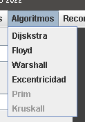
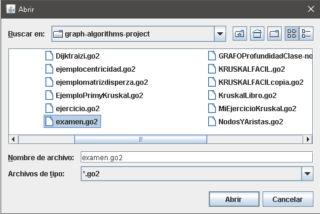
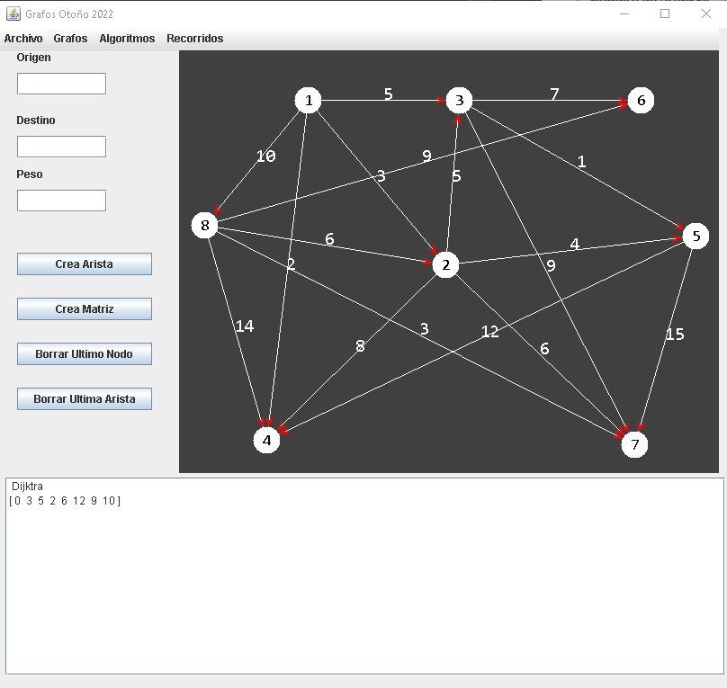
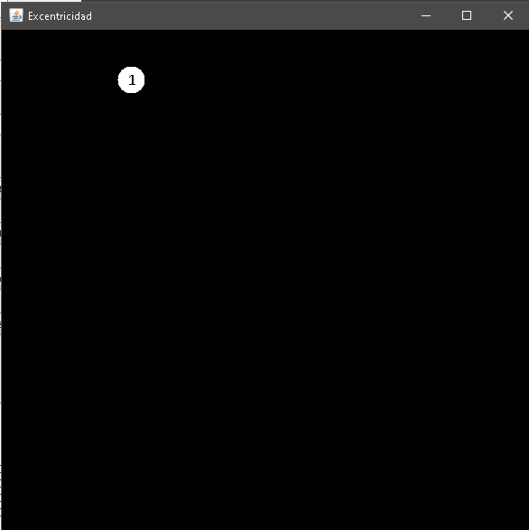
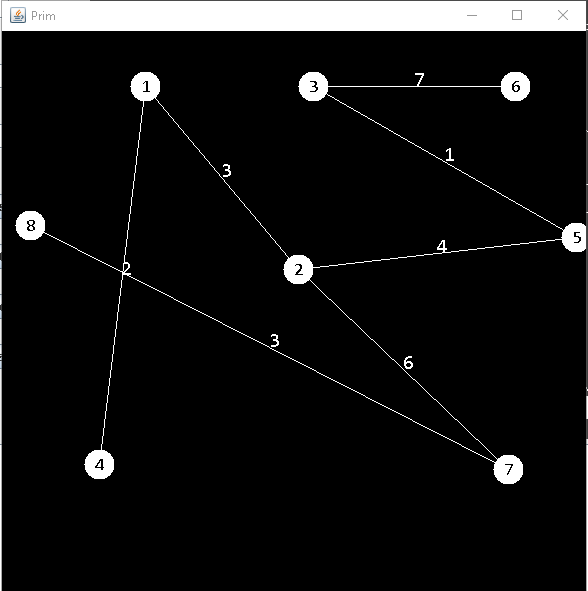
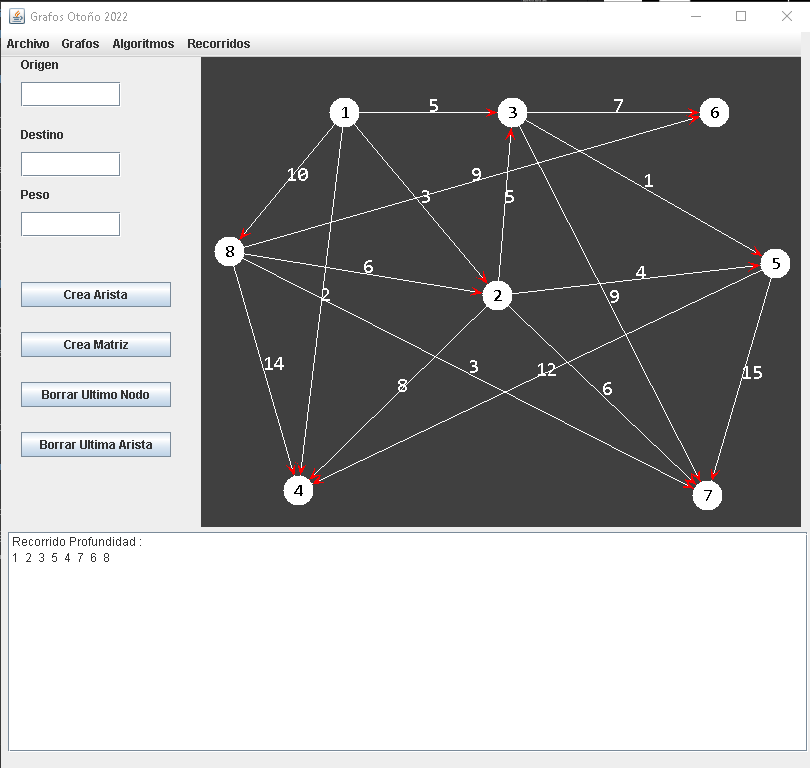

# Graph algorithms project
This project consists in a graph program about many algorithms 

### The algorithms included are

- Dijkstra's Algorithm
- Floyd-Warshall Algorithm
- Warshall's Algorithm
- Graph Eccentricity
- Prim's Algorithm
- Kruskal's Algorithm
- Depth-First Search (DFS)

_Note: Breadth-First Search (BFS) was intended but remains incomplete and is not included in this version._

***To start using the program, we create a graph or open one of the files with the .go2 extension. Afterwards, we can run the desired algorithms for directed or undirected graphs.***

+ #### Dijkstra’s Algorithm

Dijkstra’s algorithm is used to find the shortest path from a single source node to all other nodes in a weighted graph with non-negative edge weights.

+ #### Floyd-Warshall Algorithm

The Floyd-Warshall algorithm computes the shortest paths between all pairs of nodes in a weighted graph.

+ #### Warshall’s Algorithm

Warshall’s algorithm determines the transitive closure of a graph, i.e., it identifies whether a path exists between any two nodes.

+ #### Graph Eccentricity

The eccentricity of a node is the greatest distance from that node to any other node in the graph.

+ #### Prim’s Algorithm

Prim’s algorithm constructs a Minimum Spanning Tree (MST) by starting from an arbitrary node and growing the tree one edge at a time by selecting the smallest edge that connects a visited node to an unvisited node.

+ #### Kruskal’s Algorithm

Kruskal’s algorithm constructs a Minimum Spanning Tree by sorting all edges by weight and progressively adding them to the MST, provided they do not form a cycle.

+ #### Depth-First Search (DFS)

DFS explores a graph by visiting a node and recursively exploring its neighbors before backtracking. It is useful for connectivity, cycle detection, and graph traversal.

